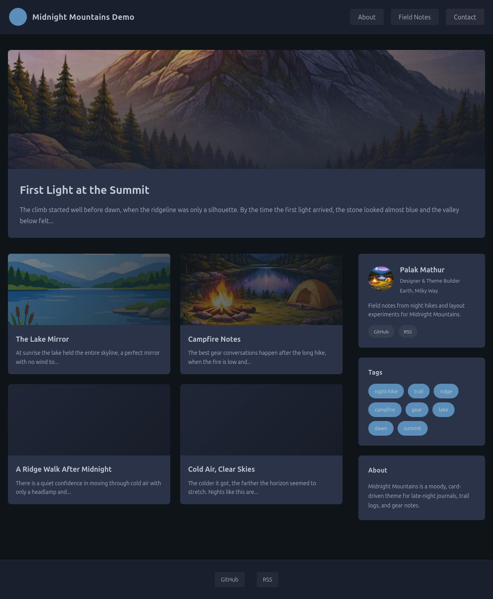

# Midnight Mountains

A dark, card-based Jekyll theme with a featured post hero and a bold sidebar layout.

## Installation

Add the gem to your site's Gemfile:

```ruby
gem "jekyll-theme-midnight-mountains"
```

Then set the theme in `_config.yml`:

```yaml
theme: jekyll-theme-midnight-mountains
```

If you see an error about the `` tag, add the plugins explicitly:

```yaml
plugins:
  - jekyll-seo-tag
  - jekyll-feed
  - jekyll-sitemap
  - jekyll-paginate
  - jekyll-gist
```

## Usage

- Use the `home` layout for the landing page, `page` for pages, and `post` for posts.
- Add `nav: true` (and optional `nav_order`) to pages to show them in the header nav.
- Add `footer_links` to `_config.yml` to populate the footer.
- Set `image` in post front matter to control card backgrounds.

Example `index.md`:

```yaml
---
layout: home
title: Home
---
```

Example nav page front matter:

```yaml
---
layout: page
title: About
nav: true
nav_order: 1
---
```

Example footer config:

```yaml
title: Midnight Mountains
footer_links:
  - title: GitHub
    url: https://github.com/systemhalted/jekyll-theme-midnight-mountains
```

## Demo

To run the demo site from the repo root:

```sh
bundle exec jekyll serve --source example
```

## Screenshot



## Development

After checking out the repo, run `bin/setup`, then `bundle exec jekyll serve`.

Run the test suite with:

```sh
bundle exec rake test
```

## Contributing

Bug reports and pull requests are welcome on GitHub at https://github.com/systemhalted/jekyll-theme-midnight-mountains. This project is intended to be a safe, welcoming space for collaboration, and contributors are expected to adhere to the [code of conduct](https://github.com/systemhalted/jekyll-theme-midnight-mountains/blob/main/CODE_OF_CONDUCT.md).

## License

The gem is available as open source under the terms of the [MIT License](https://opensource.org/licenses/MIT).

## Code of Conduct

Everyone interacting in the Midnight Mountains project's codebases, issue trackers, chat rooms and mailing lists is expected to follow the [code of conduct](https://github.com/systemhalted/jekyll-theme-midnight-mountains/blob/main/CODE_OF_CONDUCT.md).
